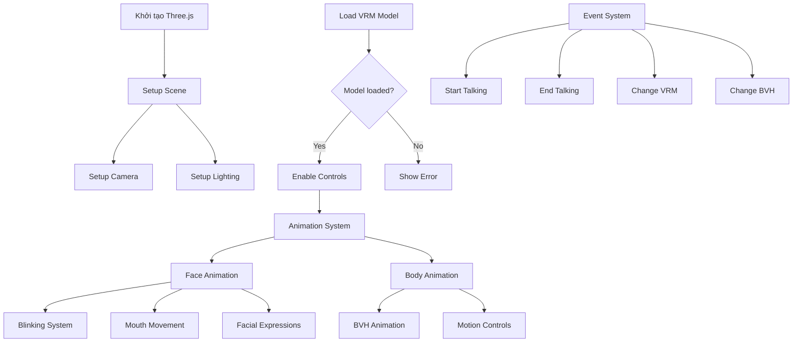

# Tracking Face Application Documentation

## Overview
This documentation explains the structure and flow of the `index.html` file, which is the main entry point of our 3D face tracking application. The application uses Three.js for 3D rendering and VRM for avatar manipulation.

## File Structure

### Dependencies
The application uses several key libraries:
- `three.js` (v0.154.0) - For 3D rendering
- `@pixiv/three-vrm` (v2.1.2) - For VRM model handling
- `@pixiv/three-vrm-animation` (v2.1.2) - For VRM animations
- Additional Three.js addons (GLTFLoader, BVHLoader)

## Main Components

### 1. Scene Setup
```javascript
- Scene initialization
- Camera setup (Perspective camera)
- WebGL Renderer configuration
- Lighting setup (DirectionalLight)
```

### 2. UI Elements
The application includes several control buttons:
- `Apply Motion` - Triggers motion animations
- `Apply motion1` - Alternative motion trigger
- `Seen Vrma` - View VRM animations
- `Seen Vrm bone` - View VRM bone structure
- `Apply Rig Face` - Apply facial rigging

### 3. Key Features

#### Animation System
- **BVH Animation Loading**: Supports loading and applying BVH motion files
- **Expression System**: Handles facial expressions and morphs
- **Blinking System**: Implements natural blinking animations
- **Voice System**: Handles mouth movements for speech (mora-based)

#### Event Handlers
The application responds to several custom events:
- `startTalking` - Initiates talking animations
- `endTalking` - Stops talking animations
- `changeVrm` - Switches VRM models
- `changeBvh` - Changes motion animations

### 4. Core Functions

#### Model Loading
- `loadVrm(vrmName)` - Loads VRM models
- `loadVRMAndListBones(url)` - Loads VRM and displays bone structure

#### Animation Control
- `applyAnimation(bvhFilePath, animationName)` - Applies motion animations
- `applyFacialExpression(vrm, rigFaceData)` - Controls facial expressions

#### Expression System
- `randomBlink()` - Controls random blinking
- `randomMora(volume)` - Handles mouth movements for speech
- `voice(mora, timeoutId, volume)` - Controls voice-based expressions

## Application Flow Diagram



## Detailed Component Breakdown

### Animation System Details
#### Face Animation
- **Blinking**: 
  - Random blink every 4-7 seconds
  - Controllable through events
  
- **Mouth Movement**:
  - Uses Mora system (a, i, u, e, o)
  - Volume-based adjustments
  
- **Facial Expressions**:
  - Managed through VRM Expression Manager
  - Supports multiple simultaneous expressions

#### Body Animation
- **BVH Animation**:
  - BVH file loading
  - VRM bones mapping
  - Model animation application
  
- **Motion Controls**:
  - Start/Stop animation functionality
  - Animation switching
  - Speed adjustment controls

### Main Processing Flow

1. **Initialization**:
   ```
   Load Three.js -> Setup Scene -> Load VRM Model
   ```

2. **Animation Loop**:
   ```
   RequestAnimationFrame
   ├── Update Face Animation
   ├── Update Body Animation
   └── Render Scene
   ```

3. **Event Handling**:
   ```
   User Input -> Event System -> Update Appropriate Component
   ```

## Usage Flow

1. **Initialization**
   - Scene and camera setup
   - Lighting configuration
   - Event listener registration

2. **Model Loading**
   - Load VRM model
   - Initialize animation system
   - Setup expression controls

3. **Animation Control**
   - Apply motions through buttons
   - Handle automatic blinking
   - Process speech animations

4. **Real-time Updates**
   - Continuous rendering loop
   - Expression updates
   - Motion blending

## Technical Notes

- The application uses a right-handed coordinate system
- Camera is positioned at (0, 1.3, -1) with specific rotation
- Supports window resizing and maintains aspect ratio
- Uses requestAnimationFrame for smooth animation

## Event System
The application implements a custom event system for:
- Model switching
- Animation changes
- Speech control
- Expression management

## Performance Considerations
- Uses efficient animation mixing
- Implements timeouts for expression control
- Maintains smooth rendering through proper resource management
