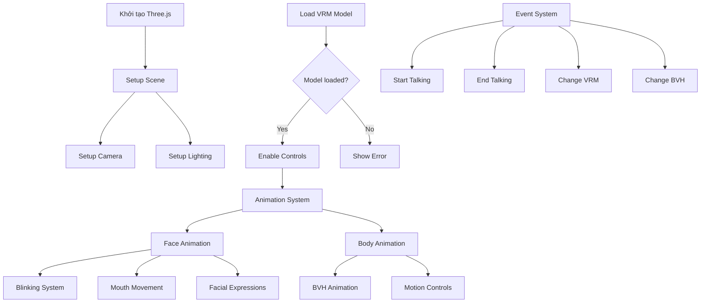

# Flow Diagram của Ứng dụng VRM Face Tracking



## Chi tiết các thành phần

### 1. Khởi tạo cơ bản
- **Three.js Setup**: Khởi tạo renderer, scene, camera
- **Lighting**: Thiết lập ánh sáng directional
- **Camera Position**: Đặt camera ở vị trí thích hợp để quan sát model

### 2. Hệ thống Animation
#### Face Animation
- **Blinking**: 
  - Random blink mỗi 4-7 giây
  - Có thể control thông qua events
  
- **Mouth Movement**:
  - Sử dụng hệ thống Mora (a, i, u, e, o)
  - Điều chỉnh theo volume
  
- **Facial Expressions**:
  - Quản lý qua VRM Expression Manager
  - Có thể set nhiều expression cùng lúc

#### Body Animation
- **BVH Animation**:
  - Load file BVH
  - Map với VRM bones
  - Apply animation vào model
  
- **Motion Controls**:
  - Start/Stop animation
  - Change animation
  - Adjust animation speed

### 3. Event System
- **Talk Events**:
  ```
  startTalking -> Trigger mouth animation
  endTalking -> Reset mouth state
  ```
  
- **Model Events**:
  ```
  changeVrm -> Load new VRM model
  changeBvh -> Load new animation
  ```

### 4. UI Controls
- Apply Motion
- Apply Rig Face
- Seen VRM
- Seen VRMA

## Luồng xử lý chính

1. **Initialization**:
   ```
   Load Three.js -> Setup Scene -> Load VRM Model
   ```

2. **Animation Loop**:
   ```
   RequestAnimationFrame
   ├── Update Face Animation
   ├── Update Body Animation
   └── Render Scene
   ```

3. **Event Handling**:
   ```
   User Input -> Event System -> Update Appropriate Component
   ```
